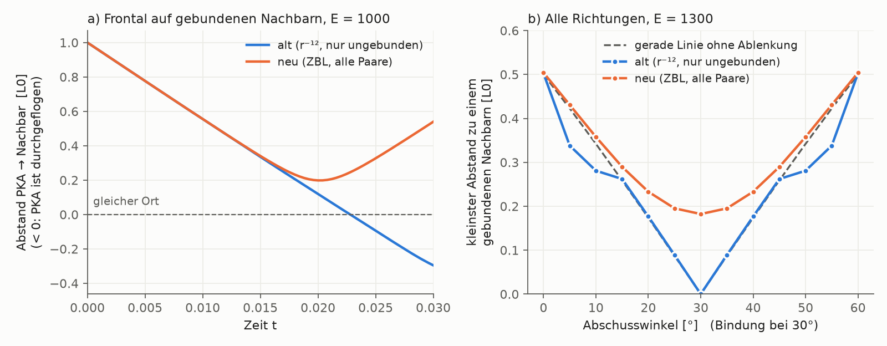

# Befund: Gebundene Nachbarn sind für schnelle Atome durchlässig

*Stand: 2026-09-24. Gefunden in Phase 0 von [`plan_zbl.md`](plan_zbl.md).
Reproduktion: `scripts/python/diag_gebundene_nachbarn.py` (≈ 10 s).*



---

## Kurzfassung

Im bisherigen Modell spüren zwei **gebundene** Nachbaratome keinerlei
Abstoßung, nur ihre Feder. Die Feder ist harmonisch und hält nie mehr als
50 Energieeinheiten aus. Ein Atom mit mehr als etwa **E ≈ 200** fliegt deshalb
mitten durch seinen gebundenen Nachbarn hindurch, und schräg anfliegend wird
es von ihm überhaupt nicht abgelenkt. Die erste Nachbarschale ist für
schnelle Atome unsichtbar. Das betrifft jedes angestoßene Atom in jeder
bisherigen Kaskade (Energien 200–2500).

Mit dem neuen ZBL-Modell (`rep_model = zbl`) ist das behoben.

---

## 1. Wie das alte Modell die Kräfte aufteilt

Das Modell kennt zwei Kräfte, und jede gilt nur für eine Sorte Paar:

| Paar | Kraft | Formel |
|---|---|---|
| **gebunden** (Feder intakt) | nur Feder | F = K·(r − L0), K = 100 |
| **ungebunden** (nie gebunden oder Feder gerissen) | nur Abstoßung | F = K_REP·((RCUT/r)¹² − 1) für r < RCUT = 0,9 |

Die Stelle im Code (`compute_forces()` in `cascade_serial.c`, vor dem Umbau):

```c
if(r2>=rc2||r2==0.0) continue;  /* zu weit oder gleich */
if(is_bonded(p,q)) continue;     /* gebunden -> Feder wirkt, keine Abstossung */
```

Die Idee dahinter ist nachvollziehbar. Im Gitter in Ruhe liegen gebundene
Nachbarn bei r = L0 = 1, also außerhalb der Abstoßungsreichweite RCUT = 0,9.
Bei kleinen Schwingungen wird die Abstoßung nie gebraucht, und man vermeidet,
dass beide Kräfte gleichzeitig wirken.

## 2. Wo das kaputtgeht

Die harmonische Feder ist eine **Näherung für kleine Auslenkungen** um L0.
Für starke Stauchung ist sie falsch: Ihr Potenzial

    V_Feder(r) = ½·K·(r − L0)²

erreicht bei r = 0, also wenn zwei Atome am selben Ort sitzen, nur

    V_Feder(0) = ½ · 100 · 1² = 50 Energieeinheiten.

Echte Atome können sich nicht durchdringen: Die Abstoßung der Elektronenhüllen
und Kerne wächst bei r → 0 unbegrenzt. In diesem Modell ist sie für gebundene
Paare dagegen auf 50 gedeckelt.

Beim Stoß zweier gleich schwerer Atome steht nur die Energie im
Schwerpunktsystem zur Verfügung, E_cm = E/2. Ist E_cm größer als der „Federberg“
von 50, kommt das Atom darüber hinweg. Für ein freies Paar wäre das ab E = 100
der Fall. Gemessen (21×21-Gitter, frontal entlang der Bindung):

| Kriterium | Schwelle |
|---|--:|
| PKA erreicht den Ort des Nachbarn (Abstand < 0,05) | E ≈ **163** |
| PKA fliegt ganz hindurch und landet jenseits des Nachbarn | E ≈ **198** |

Die Schwelle liegt über 100, vermutlich weil der Nachbar selbst an seine
übrigen Nachbarn gebunden ist und ein Teil der Energie in deren Federn geht.
Das Ergebnis ist trotzdem eindeutig: **Oberhalb von etwa 200 ist ein
gebundener Nachbar kein Hindernis.** Das Diagramm a) oben zeigt es bei E = 1000.
Der Abstand (blau) geht glatt durch null, der Nachbar bewegt sich dabei kaum.

## 3. Schräge Stöße: keine Ablenkung

Frontale Treffer sind selten. Deshalb habe ich das PKA unter allen Winkeln
abgeschossen und den kleinsten Abstand zu irgendeinem seiner 6 gebundenen
Nachbarn gemessen (Diagramm b, E = 1300).

Wird ein Atom nicht abgelenkt, fliegt es auf einer geraden Linie. Deren
kleinster Abstand zu einem Nachbarn ist rein geometrisch
sin(Winkel zwischen Flugrichtung und Bindung):

| Winkel zur Bindung | gerade Linie | altes Modell | neues Modell (ZBL) |
|--:|--:|--:|--:|
| 0° | 0,000 | **0,000** | 0,182 |
| 5° | 0,087 | **0,089** | 0,195 |
| 10° | 0,174 | **0,177** | 0,233 |
| 15° | 0,259 | **0,262** | 0,290 |

Das alte Modell folgt der geraden Linie **auf drei Stellen genau**. Das Atom
„sieht“ seinen gebundenen Nachbarn nicht. Ein realer Stoß mit Stoßparameter
0,09 L0 bei dieser Energie würde es deutlich ablenken und viel Energie
übertragen. Nur bei großen Winkeln zur Bindung (0°/60° im Diagramm) weicht die
blaue Kurve ab. Dort trifft das PKA zuerst auf Atome der zweiten Schale, zu
denen keine Bindung besteht.

## 4. Warum das die ganze Kaskade betrifft, nicht nur das PKA

Jedes Atom des Gitters ist zu Beginn an seine 6 Nachbarn gebunden. Wird es
angestoßen, sind die Atome, auf die es als Erstes zufliegt, genau diese
gebundenen Nachbarn. Das gilt für das PKA ebenso wie für jedes Sekundäratom.
Solange ein Atom mehr als ~200 Energieeinheiten hat, passiert es die erste
Schale ungebremst. Seine Federn reißen erst **danach**, durch Überdehnung
(r > 1,15 L0), nicht durch einen Stoß.

In der schnellen Phase finden damit **echte Stöße nur mit Atomen statt, zu
denen keine Bindung besteht**. Das sind Atome ab der zweiten Schale oder
solche, deren Feder schon gerissen ist.

## 5. Warum niemand es bemerkt hat

- **Die Energie bleibt erhalten.** Die Feder speichert die Energie beim
  Durchflug und gibt sie danach zurück, oder sie reißt und die Energie wird
  sauber in `E_broken` verbucht. Der Energieerhaltungstest der CI bleibt grün.
- **Das Endbild sieht plausibel aus.** Es entstehen gerissene Bindungen,
  verlagerte Atome und Cluster, nur über eine unphysikalische Stoßfolge.
- **Die Abbildung der Kraft suggeriert das Gegenteil.**
  `kursprojekt/scripts/python/fig_force_law.py` (Folienabbildung P2_kraft.png) zeichnet die
  Kraft zwischen zwei Nachbaratomen als Feder **plus** r⁻¹²-Wand. So steht es
  auch im Kommentar am Kopf von `cascade_serial.c` („Gibt Atomen einen
  effektiven Radius“). Der Code wendet die Wand auf gebundene Paare aber nie an.
  → Die Folie sollte angepasst werden (nicht Teil dieses Umbaus).

## 6. Was das für die bisherigen Ergebnisse bedeutet

| Befund | gilt weiter? | Begründung |
|---|---|---|
| S ≈ 1,4 im gepoolten Ensemble ist ein Artefakt des log-uniformen Energie-Samplings | **ja** | Rein statistisch: gilt für jede Größe mit n ~ E^k, unabhängig von der Stoßphysik |
| S hängt stark von der Clusterdefinition ab (1,23–3,30) | **ja** | Methodischer Befund über die Auswertung |
| S und KS-D fallen mit der Kaskadengröße | **ja, als Aussage über dieses Modell** | |
| Absolute S-Werte bei fester Energie (2,50 / 2,19 / 2,00), Vergleich mit Sand et al. | **nur eingeschränkt** | Die Stoßfolge der schnellen Phase ist unphysikalisch. Ein Vergleich mit einem realen Material ist damit nicht belastbar. |
| Performance-Ergebnisse des HPC-Berichts (Skalierung, CUDA) | **ja** | Hängen nicht an der Physik der Stöße |

Wie stark sich die Clusterstatistik durch die Korrektur ändert, lässt sich erst
nach dem neuen Ensemble sagen (Phase 5 in `plan_zbl.md`). Das alte Modell
bleibt als `rep_model = r12` verfügbar und liefert byte-identische Ergebnisse.
Ein direkter Vergleich auf denselben Einschlagparametern ist also möglich.

## 7. Die Korrektur

Im neuen Modell (`rep_model = zbl`) wirkt die Abstoßung auf **alle** Paare,
gebunden oder nicht. Es ist das abgeschirmte Coulomb-Potenzial nach Ziegler,
Biersack und Littmark, das bei r → 0 unbegrenzt wächst. Unterhalb von 0,85 L0
wird es glatt abgeschaltet, deshalb ändert sich an den Federn und der Ruhelage
nichts.

Ergebnis (Diagramm, orange):
- Frontal bei E = 1000 prallt das PKA bei r = 0,198 L0 ab. Die
  Zwei-Körper-Theorie für ZBL ohne Feder gibt 0,194.
- Schräg liegt der Abstand überall **über** der geraden Linie, das Atom wird
  also abgelenkt, wie es sein soll.
- Kein Durchflug mehr bis mindestens E = 10⁴ (r_min = 0,087 L0).

Wichtig für die Physik der Kaskade: Der Mindestabstand **schrumpft mit der
Energie**, 0,39 → 0,20 → 0,087 L0 bei E = 100 → 1000 → 10⁴. Schnelle Atome
haben einen kleinen Wirkungsquerschnitt, langsame einen großen. Das ist genau
die Eigenschaft, um die es im Plan geht.
