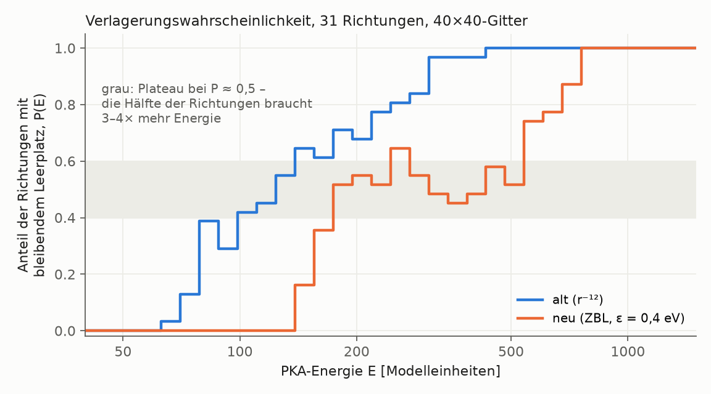

# Kalibrierung der Energieskala über E_d

Gitter 40×40, t_max = 3.0, Healing an, keine Bremsung. 31 Richtungen (0–30°, 1°), 41 Energien (30–2792, Faktor 1,12). Defekt = mindestens ein Leerplatz nach t_max (Wigner-Seitz).

E_d = ∫(1 − P(E)) dE, P = Anteil der Richtungen mit Defekt.

| Variante | E_d [Einh.] | P = 50 % bei [Einh.] | erste Schwelle min–max [Einh.] | ε·E_d [eV] |
|---|--:|--:|--:|--:|
| zbl eps=0.3 | 407.9 | 212.2 | 164–717 | 122.4 |
| zbl eps=0.4 | 382.2 | 181.9 | 147–571 | 152.9 |
| zbl eps=0.5 | 365.1 | 162.4 | 131–510 | 182.5 |
| zbl+r12 eps=0.4 | 453.5 | 200.5 | 147–717 | 181.4 |
| r12 | 159.2 | 123.9 | 66–258 | – |

**Ergebnis mit E_d = ∫(1 − P) dE: 90 eV liegt außerhalb des Messbereichs** (ε·E_d = 122–183 eV
für ε = 0,3–0,5; Extrapolation ergibt ε ≈ 0,21).

## Einordnung (2026-09-24)

- **P(E) ist im ZBL-Modell zweigeteilt.** Etwa die Hälfte der Richtungen erzeugt ab
  ~150–200 Einheiten einen bleibenden Leerplatz, die andere Hälfte erst ab ~600–800.
  Dazwischen liegt ein Plateau bei P ≈ 0,5. Im alten Modell steigt P glatt an und ist bei ~320 vollständig.
- **Die Definition von „mittlerem E_d“ entscheidet deshalb über ε, um den Faktor ~3:**

  | Definition | E_d bei ε = 0,4 [Einh.] | ε für 90 eV |
  |---|--:|--:|
  | Fläche über P, ∫(1 − P) dE (Mittel der Schwellen) | 382 | ≈ 0,21 (extrapoliert) |
  | Mittel der ersten Schwelle je Richtung (erste Iteration) | ≈ 220 | ≈ 0,40 |
  | P = 50 % (Median) | 182 | ≈ 0,6 (extrapoliert) |

- **Unabhängige Kontrolle Schallgeschwindigkeit:** Das Federmodell ergibt c_L = 7,7·√ε,
  c_T = 4,4·√ε km/s (ε in eV). Wolfram hat c_L = 5,2, c_T = 2,9 km/s, das passt bei
  **ε ≈ 0,43–0,46**. Das liegt zwischen der Median- und der Erste-Schwelle-Definition.
- **Die Bindungen sind in jedem Fall zu schwach:** Ein Bindungsbruch kostet
  ½·K·(0,15)² = 1,1 Einheiten, die Kohäsionsenergie (3 Bindungen pro Atom) beträgt also
  3,4 Einheiten = 0,7–2,0 eV bei ε = 0,21–0,6. Wolfram: 8,9 eV. Folge: Die Wärme der
  Kaskade reißt großflächig Bindungen auf (Test: 120², E = 10⁴, t = 20 → 10 % aller
  Bindungen gerissen, 45 % der Energie in gerissenen Bindungen). Siehe `docs/plan_zbl.md`, Phase 2.

## P(E)

| E [Einh.] | zbl eps=0.3 | zbl eps=0.4 | zbl eps=0.5 | zbl+r12 eps=0.4 | r12 |
|--:|--:|--:|--:|--:|--:|
| 30 | 0.00 | 0.00 | 0.00 | 0.00 | 0.00 |
| 34 | 0.00 | 0.00 | 0.00 | 0.00 | 0.00 |
| 38 | 0.00 | 0.00 | 0.00 | 0.00 | 0.00 |
| 42 | 0.00 | 0.00 | 0.00 | 0.00 | 0.00 |
| 47 | 0.00 | 0.00 | 0.00 | 0.00 | 0.00 |
| 53 | 0.00 | 0.00 | 0.00 | 0.00 | 0.00 |
| 59 | 0.00 | 0.00 | 0.00 | 0.00 | 0.00 |
| 66 | 0.00 | 0.00 | 0.00 | 0.00 | 0.03 |
| 74 | 0.00 | 0.00 | 0.00 | 0.00 | 0.13 |
| 83 | 0.00 | 0.00 | 0.00 | 0.00 | 0.39 |
| 93 | 0.00 | 0.00 | 0.00 | 0.00 | 0.29 |
| 104 | 0.00 | 0.00 | 0.00 | 0.00 | 0.42 |
| 117 | 0.00 | 0.00 | 0.00 | 0.00 | 0.45 |
| 131 | 0.00 | 0.00 | 0.10 | 0.00 | 0.55 |
| 147 | 0.00 | 0.16 | 0.35 | 0.16 | 0.65 |
| 164 | 0.03 | 0.35 | 0.52 | 0.35 | 0.61 |
| 184 | 0.29 | 0.52 | 0.52 | 0.45 | 0.71 |
| 206 | 0.48 | 0.55 | 0.58 | 0.52 | 0.68 |
| 231 | 0.55 | 0.52 | 0.52 | 0.58 | 0.77 |
| 258 | 0.61 | 0.65 | 0.48 | 0.58 | 0.81 |
| 289 | 0.71 | 0.55 | 0.42 | 0.58 | 0.84 |
| 324 | 0.61 | 0.48 | 0.39 | 0.48 | 0.97 |
| 363 | 0.55 | 0.45 | 0.39 | 0.52 | 0.97 |
| 407 | 0.61 | 0.48 | 0.48 | 0.39 | 0.97 |
| 455 | 0.58 | 0.58 | 0.65 | 0.42 | 1.00 |
| 510 | 0.52 | 0.52 | 0.61 | 0.45 | 1.00 |
| 571 | 0.61 | 0.74 | 0.74 | 0.52 | 1.00 |
| 640 | 0.77 | 0.77 | 0.87 | 0.61 | 1.00 |
| 717 | 0.71 | 0.87 | 0.97 | 0.61 | 1.00 |
| 802 | 0.94 | 1.00 | 1.00 | 0.90 | 1.00 |
| 899 | 0.97 | 1.00 | 1.00 | 1.00 | 1.00 |
| 1007 | 1.00 | 1.00 | 1.00 | 1.00 | 1.00 |
| 1127 | 1.00 | 1.00 | 1.00 | 1.00 | 1.00 |
| 1263 | 1.00 | 1.00 | 1.00 | 1.00 | 1.00 |
| 1414 | 1.00 | 1.00 | 1.00 | 1.00 | 1.00 |
| 1584 | 1.00 | 1.00 | 1.00 | 1.00 | 1.00 |
| 1774 | 1.00 | 1.00 | 1.00 | 1.00 | 1.00 |
| 1987 | 1.00 | 1.00 | 1.00 | 1.00 | 1.00 |
| 2225 | 1.00 | 1.00 | 1.00 | 1.00 | 1.00 |
| 2492 | 1.00 | 1.00 | 1.00 | 1.00 | 1.00 |
| 2792 | 1.00 | 1.00 | 1.00 | 1.00 | 1.00 |
